# `ExposureTask.run()` Evidence–Action Flow

## Purpose and scope

This document describes the flow implemented by
[`ExposureTask.run()`](../../virusflow/tasks/exposure.py#L157), including the
delegated detector and physical-CCD work in
[`ReducedScienceAmplifierTask`](../../virusflow/tasks/science.py#L84) and
[`PhysicalCCDTask`](../../virusflow/tasks/science.py#L190).

The graph is an implementation map, not a proposed replacement architecture.
It follows one atomic Exposure from raw amplifier measurements to the persisted
Exposure Products and the run-local `CalibratedFiberState` returned for
observation assembly.

## Graph ontology

The repository ontology distinguishes configuration, measurement, and
inference, and treats immutable Products as evidence. It does not currently
define `Evidence` or `Action` Python entity types. This document therefore uses
the following analytical vocabulary over the implemented objects:

| Graph concept | Meaning in this document | Examples |
|---|---|---|
| **Evidence** | A measurement, configuration record, or inferred Product consumed by an operation | raw science frame, `master_bias`, `trace_map`, header fields, catalog rows |
| **Action** | A deterministic transform, selection, fit, classification, or publication step | subtract bias, assemble a physical CCD, fit astrometry, publish a Product |
| **Run-local state** | An array or typed state used during this run but not persisted as an Artifact | `ReducedAmplifierState`, extracted spectra, sky prediction, `CalibratedFiberState` |
| **Product** | An immutable persisted Artifact with components, scope, parents, configuration references, and QA | `ccd_scattered_light_model`, `sky_model`, `final_astrometry` |
| **Guard** | A validation or fallback decision that controls whether processing continues | complete calibration coverage, valid wavelength rows, catalog-fit success |

In the requested bias example, `master_bias` is inferred calibration evidence.
The action is not merely “subtract the master bias”: the implemented detector
action also constructs and subtracts an exposure-scaled dark residual, adds
bias scatter to the variance, and extends the mask.

```text
dark_residual = master_dark - master_bias
dark_scale    = science_EXPTIME / dark_EXPTIME, or 1

calibrated_image =
    oriented_image
    - master_bias
    - dark_scale * dark_residual

calibrated_variance =
    detector_variance
    + per_pixel_bias_scatter²

calibrated_mask =
    nonfinite_mask
    OR dark_pixel_mask
    OR master_ldls.flat_response_mask
```

This exact implementation is in
[`ReducedScienceAmplifierTask.run()`](../../virusflow/tasks/science.py#L134-L167).

## Full implemented flow

The most informative representation is a multi-scope evidence–action dataflow.
It shows computational consumption with solid arrows, gating or fallback with
dashed arrows, and repeated work at amplifier and physical-CCD cardinalities.
Persisted parent-ID lineage is tabulated separately after the graph because
parent provenance and numerical dataflow are related but not identical.

```mermaid
flowchart TB
    classDef evidence fill:#fff4cc,stroke:#9a6b00,color:#2d2500,stroke-width:1.5px
    classDef action fill:#dbeafe,stroke:#1d4ed8,color:#0f2147,stroke-width:1.5px
    classDef state fill:#f3e8ff,stroke:#7e22ce,color:#351056,stroke-width:1.5px
    classDef product fill:#dcfce7,stroke:#15803d,color:#103b1f,stroke-width:2px
    classDef guard fill:#ffe4e6,stroke:#be123c,color:#4c101d,stroke-width:1.5px
    classDef terminal fill:#f1f5f9,stroke:#475569,color:#172033,stroke-width:1.5px

    subgraph L0["Exposure discovery and evidence resolution — once per Exposure"]
        ETarget["Evidence: ExposureTarget<br/>exposure_id + at_time"]:::evidence
        ERawIndex["Evidence: registry science raw rows<br/>with complete ZipCode"]:::evidence
        ADiscover(["Action: select frame_type=sci;<br/>sort and validate unique amplifiers"]):::action
        GRaw{"Science rows exist<br/>and ZipCodes are unique?"}:::guard
        XRaw["Abort Exposure"]:::terminal

        EHeader["Evidence: representative first raw header"]:::evidence
        EConfig["Evidence: configuration<br/>F-plane + per-IFUID fiber offsets<br/>exposure references"]:::evidence
        AResolve(["Action: resolve configuration<br/>and representative header"]):::action

        ECal["Evidence set per amplifier:<br/>master_bias, master_dark, master_ldls,<br/>master_arc, master_twilight,<br/>trace_map, wavelength_map"]:::evidence
        ASelect(["Action: select each calibration<br/>latest_valid, then nearest fallback"]):::action
        GCal{"At least one amplifier has<br/>all seven calibration kinds?"}:::guard
        XCal["Abort: no complete<br/>calibration coverage"]:::terminal

        ETarget --> ADiscover
        ERawIndex --> ADiscover --> GRaw
        GRaw -. no .-> XRaw
        GRaw -. yes .-> AResolve
        EHeader --> AResolve
        EConfig --> AResolve
        AResolve --> ASelect
        ECal --> ASelect --> GCal
        GCal -. no .-> XCal
    end

    subgraph L1["Detector reduction — repeated per amplifier ZipCode"]
        ERawAmp["Evidence: one raw science<br/>amplifier array + header"]:::evidence
        ADetector(["Action: robust row overscan subtraction<br/>trim → orient → gain multiplication<br/>initialize Poisson + read-noise variance"]):::action
        SDetector[["Run-local: oriented image<br/>detector variance + nonfinite mask"]]:::state

        EBias["Evidence: master_bias<br/>master + per_pixel_bias_scatter"]:::evidence
        EDark["Evidence: master_dark<br/>master_dark + dark_pixel_mask"]:::evidence
        EDarkTime["Evidence: first same-day raw dark EXPTIME<br/>and science EXPTIME"]:::evidence
        ELDLS["Evidence: master_ldls.flat_response_mask"]:::evidence
        ACalibrate(["Action: dark_residual = dark - bias<br/>image -= bias + scale × dark_residual<br/>variance += bias_scatter²<br/>mask |= dark + LDLS + nonfinite"]):::action
        SReduced[["Run-local: ReducedAmplifierState<br/>image + variance + mask + header<br/>parents: raw, bias, dark, LDLS"]]:::state

        ERawAmp --> ADetector --> SDetector
        SDetector --> ACalibrate
        EBias --> ACalibrate
        EDark --> ACalibrate
        EDarkTime --> ACalibrate
        ELDLS --> ACalibrate
        ACalibrate --> SReduced
    end

    subgraph L2["Physical-CCD correction — repeated for LL+LU and RU+RL pairs"]
        GPair{"Both partner amplifiers reduced<br/>and both traces available?"}:::guard
        ETracePair["Evidence: paired trace maps<br/>+ physical CCD transform"]:::evidence
        AAssemble(["Action: assemble zero-indexed physical CCD<br/>reflect upper amplifier with y = 2063 - y"]):::action
        SCCD[["Run-local: physical CCD image<br/>variance + mask + seam/source maps"]]:::state
        AScatter(["Action: select inter-trace gap samples<br/>hold out chunks; robust degree-2 fit<br/>subtract fitted scattered-light surface"]):::action
        PScatter[("Product: ccd_scattered_light_model<br/>scope: PHYSICAL_CCD")]:::product
        SScatter[["Run-local: scatter-subtracted CCD<br/>plus full fit diagnostics"]]:::state
        XPair["Record both-amplifier failure;<br/>skip this CCD pair"]:::terminal

        SReduced --> GPair
        ETracePair --> GPair
        GPair -. no .-> XPair
        GPair -. yes .-> AAssemble
        ETracePair --> AAssemble
        SReduced --> AAssemble --> SCCD
        SCCD --> AScatter
        ETracePair --> AScatter
        AScatter --> PScatter
        AScatter --> SScatter
    end

    subgraph L3["Twilight normalization and science extraction — repeated per usable amplifier"]
        ETwilight["Evidence: paired master_twilight images"]:::evidence
        ATwiScatter(["Action: assemble twilight physical CCD;<br/>fit and subtract scatter in memory"]):::action
        STwiScatter[["Run-local: scatter-subtracted twilight"]]:::state
        ATwiExtract(["Action: split to amplifier;<br/>fractional 5-pixel twilight extraction"]):::action
        AWithin(["Action: divide each fiber by common twilight;<br/>51-pixel median smoothing;<br/>unit-median per-fiber normalization"]):::action
        SWithin[["Run-local: within-amp response<br/>raw ratio + valid mask + common twilight"]]:::state

        AScienceExtract(["Action: split scatter-corrected science CCD;<br/>fractional 5-pixel extraction using<br/>trace, variance, and pixel mask"]):::action
        SExtract[["Run-local: spectrum + propagated variance<br/>valid-pixel fraction + aperture evidence"]]:::state
        EWave["Evidence: wavelength_map"]:::evidence
        GWave{"Shape matches extraction and fiber row<br/>is finite + strictly increasing?"}:::guard
        XWave["Record amplifier failure or<br/>exclude only invalid fiber rows"]:::terminal
        SAmpResult[["Run-local amp result:<br/>spectrum, variance, validity, wavelength,<br/>within response, twilight level, parents"]]:::state

        ETwilight --> ATwiScatter
        ETracePair --> ATwiScatter
        ATwiScatter --> STwiScatter --> ATwiExtract
        ETracePair --> ATwiExtract
        ATwiExtract --> AWithin --> SWithin

        SScatter --> AScienceExtract
        ETracePair --> AScienceExtract
        AScienceExtract --> SExtract
        SExtract --> GWave
        EWave --> GWave
        GWave -. invalid .-> XWave
        GWave -. valid rows .-> SAmpResult
        SExtract --> SAmpResult
        SWithin --> SAmpResult
        EWave --> SAmpResult
        PScatter --> SAmpResult
    end

    subgraph L4["Exposure-wide fiber frame and normalization"]
        GExtract{"At least one amplifier<br/>produced extractable fibers?"}:::guard
        XExtract["Abort: no extractable amplifier"]:::terminal
        AAmpNorm(["Action: median common-twilight level per amp;<br/>divide by exposure-wide median level"]):::action
        PAmpNorm[("Product: amp_to_amp_normalization<br/>scope: EXPOSURE")]:::product
        ANormalize(["Action: final normalization = within × amp factor<br/>spectrum /= final normalization<br/>variance /= final normalization²"]):::action
        AGlobal(["Action: remove invalid wavelength fibers;<br/>attach fiber identity and<br/>F-plane + local focal offsets; concatenate"]):::action
        SGlobal[["Run-local global fiber frame:<br/>normalized spectrum + variance + validity<br/>wavelength + identity + focal coordinates<br/>within response"]]:::state

        SAmpResult --> GExtract
        GExtract -. no .-> XExtract
        GExtract -. yes .-> AAmpNorm
        AAmpNorm --> PAmpNorm
        SAmpResult --> ANormalize
        PAmpNorm --> ANormalize
        ANormalize --> AGlobal
        EConfig --> AGlobal
        AGlobal --> SGlobal
    end

    subgraph L5["Astrometry and source evidence"]
        AInitial(["Action: parse pointing fallback chain<br/>TRAJCRA/C → TRAJRA/DEC → QRA/QDEC;<br/>apply TAN transform to focal coordinates"]):::action
        PInitial[("Product: initial_astrometry<br/>scope: EXPOSURE")]:::product
        ADetect(["Action: median spectrum to broadband;<br/>robust per-IFUSLOT source detection"]):::action
        PDetect[("Product: source_detection_catalog<br/>scope: EXPOSURE")]:::product
        ECatalog["Evidence: Pan-STARRS cone-search rows<br/>or configured catalog provider"]:::evidence
        AFitAstro(["Action: nearest catalog match;<br/>magnitude + separation filters;<br/>coherent offset cluster; rigid shift/rotation fit"]):::action
        PMatch[("Product: catalog_match_table<br/>scope: EXPOSURE")]:::product
        GAstro{"At least four coherent matches?"}:::guard
        ARefine(["Action: update tangent point + PA"]):::action
        AFallback(["Action: retain initial header TAN solution;<br/>mark degraded"]):::action
        PFinal[("Product: final_astrometry<br/>scope: EXPOSURE")]:::product
        ACoordinates(["Action: evaluate final TAN coordinates<br/>for every retained fiber"]):::action
        PCoordinates[("Product: fiber_sky_coordinates<br/>scope: FIBER")]:::product

        EHeader --> AInitial
        EConfig --> AInitial
        SGlobal --> AInitial --> PInitial
        SGlobal --> ADetect
        PInitial --> ADetect --> PDetect
        PDetect --> AFitAstro
        ECatalog --> AFitAstro --> PMatch
        AFitAstro --> GAstro
        GAstro -. success .-> ARefine
        GAstro -. failure or catalog error .-> AFallback
        ARefine --> PFinal
        AFallback --> PFinal
        PFinal --> ACoordinates
        SGlobal --> ACoordinates --> PCoordinates
    end

    subgraph L6["Sky, illumination, response, and calibrated fiber state"]
        ASkySelect(["Action: reject detected sources;<br/>require median valid fraction ≥ 0.8;<br/>robust broadband upper cut"]):::action
        PSkyMask[("Product: sky_fiber_mask<br/>scope: FIBER")]:::product
        ASampling(["Action: infer wavelength bin widths;<br/>derive or accept oversampling factor;<br/>combine blank-fiber flux density"]):::action
        SLatent[["Run-local: latent sky grid<br/>flux-density mean + variance + counts"]]:::state

        AIllum(["Action: median blank-sky broadband per amp;<br/>divide by global amplifier median;<br/>broadcast factor to fibers"]):::action
        PIllum[("Product: exposure_illumination_correction<br/>scope: EXPOSURE")]:::product
        PSky[("Product: sky_model<br/>scope: EXPOSURE")]:::product
        AEvaluateSky(["Action: integrate latent sky through each<br/>native wavelength bin × fiber illumination"]):::action
        SSkyPrediction[["Run-local: fiber sky prediction"]]:::state
        ASubtractSky(["Action: sky_subtracted =<br/>normalized spectrum - sky prediction"]):::action
        SSkySub[["Run-local: sky-subtracted spectrum<br/>+ sky residual robust sigma"]]:::state

        ABaseline(["Action: create explicit provisional<br/>identity response on latent grid"]):::action
        PBaseline[("Product: baseline_relative_response<br/>scope: INSTRUMENT_EPOCH<br/>always WARN / degraded")]:::product
        AResponse(["Action: compact within-amp response to knots;<br/>attach amp and illumination factors"]):::action
        PResponse[("Product: fiber_response_model<br/>scope: EXPOSURE<br/>always WARN / degraded")]:::product

        ACalibrated(["Action: divide sky-subtracted flux by<br/>fiber illumination; divide variance by factor²;<br/>set nonfinite and low-validity mask bits;<br/>apply storage scale constants"]):::action
        SCalibrated[["Run-local output: CalibratedFiberState<br/>flux + variance + mask + wavelength<br/>sky/focal coordinates + model IDs"]]:::state

        SGlobal --> ASkySelect
        PDetect --> ASkySelect
        ASkySelect --> PSkyMask
        PSkyMask --> ASampling
        SGlobal --> ASampling --> SLatent
        PSkyMask --> AIllum
        SGlobal --> AIllum --> PIllum
        SLatent --> PSky
        PIllum --> PSky
        PSky --> AEvaluateSky
        SGlobal --> AEvaluateSky --> SSkyPrediction
        SSkyPrediction --> ASubtractSky
        SGlobal --> ASubtractSky --> SSkySub
        SLatent --> ABaseline --> PBaseline
        SGlobal --> AResponse
        PAmpNorm --> AResponse
        PIllum --> AResponse
        PBaseline --> AResponse
        AResponse --> PResponse
        SSkySub --> ACalibrated
        PIllum --> ACalibrated
        PCoordinates --> ACalibrated
        PFinal --> ACalibrated
        PResponse -. model ID and metadata .-> ACalibrated
        PSky -. model ID and metadata .-> ACalibrated
        ACalibrated --> SCalibrated
    end

    subgraph L7["Observing mode, completion, and returned bundle"]
        AMode(["Action: interpret representative header<br/>as primary or parallel"]):::action
        PMode[("Product: exposure_mode_classification<br/>scope: EXPOSURE")]:::product
        AEffective(["Action: primary → EXPTIME;<br/>parallel → max(0, PEXPTIME - policy offset)"]):::action
        PEffective[("Product: effective_exposure_time<br/>scope: EXPOSURE")]:::product

        EFailures["Evidence: accumulated amplifier failures<br/>+ wavelength-fiber exclusions"]:::evidence
        EQA["Evidence: QA status of all registry Products<br/>for this exposure before manifest publication"]:::evidence
        AManifest(["Action: build coverage matrix and counts;<br/>PASS if complete, otherwise WARN/degraded"]):::action
        PManifest[("Product: exposure_completion_manifest<br/>scope: EXPOSURE")]:::product
        OReturn["Return 14 persisted Products<br/>+ run-local CalibratedFiberState"]:::terminal

        EHeader --> AMode --> PMode --> AEffective --> PEffective
        EFailures --> AManifest
        EQA --> AManifest
        PSky --> AManifest
        PResponse --> AManifest
        PEffective --> AManifest
        PFinal --> AManifest
        AManifest --> PManifest
        PManifest --> OReturn
        SCalibrated --> OReturn
    end

    GCal -. yes .-> ERawAmp
    GCal -. begin per-amplifier processing .-> GPair
    ECal -. master_arc has no downstream numerical use .-> GCal
```



Every persisted Product above is published through `ArtifactRequest` and
receives a QA bundle. Most use `_request()`, whose defaults are `pass` and
`usable`; the exceptions are listed below.

## Persisted parent lineage

This table records the direct `parents` written by the implementation. It is
not the same as the computational graph: configuration references, component
values copied into a Product, and run-local dependencies do not automatically
become parent Artifact IDs.

| Persisted Product | Scope | Direct parent Artifact IDs |
|---|---|---|
| `ccd_scattered_light_model` | Physical CCD | both raw science row IDs; both amplifiers' `master_bias` and `master_dark`; `master_ldls` where selected; both `trace_map` Products |
| `amp_to_amp_normalization` | Exposure | each retained amplifier's scatter model, trace, wavelength map, and master twilight |
| `initial_astrometry` | Exposure | all successful physical-CCD scatter models |
| `source_detection_catalog` | Exposure | initial astrometry and all successful scatter models |
| `catalog_match_table` | Exposure | initial astrometry and source-detection catalog |
| `final_astrometry` | Exposure | initial astrometry and catalog-match table |
| `fiber_sky_coordinates` | Fiber | final astrometry |
| `sky_fiber_mask` | Fiber | fiber coordinates, source detections, amp normalization, and each retained amplifier's scatter/trace/wavelength/twilight parents |
| `exposure_illumination_correction` | Exposure | sky-fiber mask |
| `sky_model` | Exposure | sky-fiber mask, illumination correction, amp normalization, and each retained amplifier's scatter/trace/wavelength/twilight parents |
| `baseline_relative_response` | Instrument epoch | none |
| `fiber_response_model` | Exposure | baseline response, illumination correction, amp normalization, and each retained amplifier's scatter/trace/wavelength/twilight parents |
| `exposure_mode_classification` | Exposure | initial astrometry |
| `effective_exposure_time` | Exposure | exposure-mode classification |
| `exposure_completion_manifest` | Exposure | sky model, fiber-response model, effective exposure time, and final astrometry |

The physical-CCD scatter model is published inside `PhysicalCCDTask` but is not
a top-level key in the dictionary returned by `ExposureTask`. It remains
reachable through Artifact lineage and its ID is embedded in the run-local
calibrated state.

## Flow findings

### 1. Calibration Products act as typed evidence for explicit actions

The implementation supports the requested evidence/action reading well:

- raw science frames are measured evidence for overscan, orientation, gain, and
  variance construction;
- `master_bias`, `master_dark`, and calibration masks are inferred evidence for
  detector correction;
- trace maps are inferred evidence for both physical-CCD background fitting and
  extraction geometry;
- wavelength maps are inferred evidence for attaching and validating native
  spectral coordinates;
- master twilight Products are inferred evidence for within-amplifier and
  exposure-wide normalization;
- header fields and external catalog rows are evidence for astrometric and
  exposure-time inferences.

The closest registered relations are `derived_from`, `calibrated_by`,
`uses_configuration`, `predicts`, and `refines`. “Action” is best understood as
the algorithmic operation that realizes one of those relations, not as another
Product kind.

### 2. The bias action has two roles and a non-obvious algebra

`master_bias` contributes:

1. its `master` component to the detector-image correction; and
2. its `per_pixel_bias_scatter` component to the propagated variance.

Because the selected `master_dark` is treated as containing bias, the code
first forms `master_dark - master_bias`. When `dark_scale == 1`, the bias terms
cancel algebraically in the image:

```text
image - bias - (dark - bias) = image - dark
```

The bias-scatter variance is still added. The dark exposure used to calculate
`dark_scale` comes from the first same-day raw dark row for that ZipCode, not
from a component or metadata field of the selected `master_dark` Artifact.

### 3. The seven-kind calibration gate is stricter than numerical use

An amplifier counts as having complete calibration coverage only if all of
these exist:

```text
master_bias
master_dark
master_ldls
master_arc
master_twilight
trace_map
wavelength_map
```

`master_arc` is never loaded or numerically consumed later in
`ExposureTask.run()`. Its scientific information is already upstream of the
selected wavelength map. Operationally it affects the global completeness gate
and, when missing, the recorded failure state and completion status; it does not
drive a downstream numerical action. Likewise, the `master_ldls` image is not
used as a flat-field divisor; only its `flat_response_mask` is merged into the
science mask.

### 4. The physical-CCD boundary is correctly preserved

Scattered light is not estimated independently per amplifier. The task requires
the physical pairs `LL + LU` and `RU + RL`, assembles each in the canonical
zero-indexed coordinate system, and fits one smooth gap-constrained surface
across the pair. A missing or failed partner makes both amplifiers unavailable
for this stage.

The compact fitted model and bounded residual evidence are persisted. The dense
assembly and scatter-subtracted image remain run-local.

### 5. Normalization and final response are factorized across the flow

The numerical order is:

```text
extracted spectrum
    / (within-amplifier normalization × amp-to-amp factor)
    = normalized spectrum

sky prediction
    = latent incident sky × exposure illumination factor

calibrated flux
    = (normalized spectrum - sky prediction)
      / exposure illumination factor
```

The provisional baseline relative response is an explicit identity array of
ones and is not numerically applied. The persisted `fiber_response_model`
records within-amplifier knots, amp factors, and illumination factors, but its
`evaluate()` method is not called by `ExposureTask`. This is internally
consistent with the earlier normalization steps, but it is important when
interpreting the Product as a record of factorization rather than the single
array used in one terminal division.

### 6. Important scientific intermediates are deliberately transient

The implementation and focused exposure test prohibit persistence of:

```text
reduced_science_image
scatter_subtracted_image
aperture_extracted_spectrum
extracted_variance
fiber_sky_prediction
sky_subtracted_spectrum
final_exposure_response
```

The completion manifest records `persistent_science_intermediates: []`.
`CalibratedFiberState` is also run-local and is passed to observation assembly.

There is a notable evidence-retention gap relative to the knowledge-system
guidance: `within_amplifier_normalization()` computes the raw twilight ratio,
normalization-valid mask, common twilight, and a twilight scatter holdout
sigma, but only the smoothed normalization contributes to later Products. The
raw ratio, valid mask, and twilight fit diagnostic are not published or included
in the returned state even though a registered
`within_amp_fiber_normalization` Product kind exists.

### 7. Variance propagation is explicit but incomplete

Implemented variance actions include:

- detector read-noise plus nonnegative signal variance;
- addition of squared per-pixel bias scatter;
- exact squared fractional-aperture weights;
- division by squared within-amplifier and amp-to-amp normalization;
- division by squared exposure-illumination factor.

The final state explicitly declares that it contains extracted statistical
variance only. Dark-model uncertainty, latent-sky uncertainty/covariance, and
response-model covariance are not added to the calibrated variance. In
particular, subtracting the evaluated sky prediction does not add the persisted
sky-model variance to `spectrum_variance`.

### 8. Failure handling favors partial Exposure completion

The task aborts for:

- no science raw inputs;
- duplicate amplifier identity;
- no amplifier with all seven selected calibration kinds;
- no extractable amplifier after pair correction/extraction; or
- no global fiber arrays after focal-plane validation.

Many detector, pair, and wavelength failures are caught, recorded per
amplifier, and skipped. Invalid wavelength rows are excluded fiber by fiber when
at least one valid row remains. A catalog provider failure or insufficient
astrometric matches produces warning/degraded catalog, final-astrometry, and
coordinate Products while retaining the header-derived TAN solution.

This partial-completion behavior is not universal. For example, once a
physical-CCD pair exists, both `master_twilight` Products are accessed by direct
dictionary indexing without a local guard. A missing twilight can therefore
raise an uncaught `KeyError` even though calibration selection initially records
the missing kind as an amplifier failure. Missing usable pointing, no finite sky
samples, and malformed configuration can likewise abort through downstream
algorithm validation.

The completion manifest is `pass/usable` only when there are no recorded
amplifier failures and no wavelength-fiber exclusions; otherwise it is
`warn/degraded`.

### 9. Evidence identity is complete in ancestry but compressed in fiber arrays

Amplifier discovery and grouping use the complete ZipCode:

```text
IFUSLOT + IFUID + SPECID + AMP + CONTROLLER
```

The concatenated `fiber_identity` array stores:

```text
amp_index, original_fiber_index, IFUSLOT, SPECID, AMP_CODE
```

It omits `IFUID` and `CONTROLLER` as explicit columns. Those identities remain
recoverable through the amp index, ordered ZipCodes, configuration references,
and Artifact ancestry, but the final run-local array is not independently a
complete hardware-lineage record.

### 10. One representative amplifier header controls Exposure-wide inference

The first sorted science raw row supplies the header used for pointing,
catalog-query center, observing-mode classification, and effective exposure
time. The task does not compare those fields across amplifier headers. The flow
therefore assumes Exposure-level header consistency.

### 11. Product QA and computational acceptance are only partially coupled

Every published Product gets QA facts and a status/usability bundle. The
physical-CCD model fails QA only when its holdout residual sigma is non-finite.
Catalog-dependent Products degrade on fit failure, and baseline/fiber-response
Products are always warning/degraded because the historical response evidence
is absent.

Calibration selection itself uses time policy (`latest_valid`, then `nearest`)
but does not request a minimum QA state in this task. The completion manifest
counts statuses already in the registry, yet those counts do not change which
calibrations were numerically used. Similarly, `PhysicalCCDTask` can publish a
`fail/unusable` scatter model when its holdout sigma is non-finite and still
return the run-local scatter state; `ExposureTask` does not inspect that QA
status before continuing with extraction.

## Architectural disposition

| Classification | Finding |
|---|---|
| **KEEP** | Atomic Exposure scope, complete ZipCode discovery, physical-CCD paired scatter fitting, explicit astrometry fallback, per-fiber wavelength exclusions, and partial-amplifier completion |
| **ADAPT** | Publish or otherwise retain within-amplifier raw ratios, valid masks, twilight scatter diagnostics, and complete fiber hardware identity |
| **REFACTOR** | Move array arithmetic still embedded in `ExposureTask.run()`—illumination estimation, response application, mask construction, and several validations—behind pure algorithm contracts while preserving results |
| **RESEARCH** | Validate the mandatory-but-unused `master_arc` gate, the raw-dark source of dark exposure time, and the intended future application of non-identity baseline response |

These dispositions compare the implemented flow with the repository's
ontology-first and evidence-preservation guidance; they do not change the
current scientific behavior.

## Primary implementation references

- [`ExposureTask.run()`](../../virusflow/tasks/exposure.py#L157)
- [`ReducedScienceAmplifierTask.run()`](../../virusflow/tasks/science.py#L88)
- [`PhysicalCCDTask.run()`](../../virusflow/tasks/science.py#L214)
- [`reduce_amplifier_array()`](../../virusflow/algorithms/ccd.py#L49)
- [`fit_gap_scattered_light()`](../../virusflow/algorithms/physical_ccd.py#L238)
- [`extract_fractional_aperture()`](../../virusflow/algorithms/exposure.py#L218)
- [`within_amplifier_normalization()`](../../virusflow/algorithms/exposure.py#L260)
- [`fit_catalog_astrometry()`](../../virusflow/algorithms/exposure.py#L383)
- [`oversampled_incident_sky()`](../../virusflow/algorithms/exposure.py#L448)
- [`classify_mode_and_effective_time()`](../../virusflow/algorithms/exposure.py#L552)
- [`test_full_exposure_task_fixture_produces_baseline_products_and_refined_catalog_astrometry`](../../tests/test_exposure_task.py#L44)
